# Routing Tables & VLANs
**Studied:** June 26, 2026

# Theory Block — Routing Tables & VLANs

Let's go through this properly — not a shallow overview, but the level of understanding needed to explain it to a committee and to inform your feature engineering later.

---

## Part 1 — Routing Tables & Path Selection

### What a routing table actually is

Every router maintains a table of known networks and what to do with packets destined for them. When a packet arrives, the router looks at the **destination IP address** and finds the best matching entry.

A simplified table looks like this:

| Network | Prefix Length | Next Hop | Interface | Protocol | AD | Metric |
|---|---|---|---|---|---|---|
| 192.168.1.0 | /24 | — | eth0 | Connected | 0 | 0 |
| 10.0.0.0 | /8 | 192.168.1.1 | eth0 | Static | 1 | 0 |
| 0.0.0.0 | /0 | 203.0.113.1 | eth1 | Static | 1 | 0 |

### Longest Prefix Match — the core rule

When a destination IP matches multiple entries, the router picks the **most specific** one — the entry with the longest prefix (most bits specified).

**Example:** packet destined for `192.168.1.55`

- Matches `192.168.1.0/24` → 24 bits match
- Matches `0.0.0.0/0` → 0 bits match (default route, matches everything)

The router picks `/24` because it's more specific. This is longest prefix match. It's why you can have a default route (`0.0.0.0/0`) as a catch-all while more specific routes override it for known networks.

**Why this matters for your thesis:** NSL-KDD's `dst_host_count` and routing-related features make more sense once you understand that traffic anomalies often look like unusual destination distributions — many packets matching only the default route (scanning unknown IPs) vs normal traffic hitting specific known prefixes.

---

### Administrative Distance — choosing between protocols

When two different routing protocols both have a route to the same network, the router uses **Administrative Distance (AD)** — a trustworthiness score. Lower = more trusted.

| Source | AD |
|---|---|
| Connected interface | 0 |
| Static route | 1 |
| OSPF | 110 |
| RIP | 120 |
| Unknown/untrusted | 255 |

If OSPF says "network X is reachable via router A" and RIP says "network X is reachable via router B", the router installs the OSPF route because 110 < 120. RIP's route doesn't even appear in the forwarding table.

---

### Static vs Dynamic Routes

**Static routes** — manually configured by an admin. Never change unless someone edits them. Used for small networks, stub connections (a branch office with one uplink), or default routes.

```
ip route 10.10.0.0 255.255.0.0 192.168.1.1
```

No overhead, no protocol traffic, no automatic failover if the next hop dies.

**Dynamic routes** — learned automatically via routing protocols. The three you need to know:

---

### RIP (Routing Information Protocol)

- **Metric:** hop count. Max 15 hops — anything beyond is "unreachable." This makes RIP unsuitable for large networks.
- **Type:** Distance-vector. Each router tells its neighbors its full routing table ("I can reach X in 3 hops"). Neighbors update their own tables. Slow convergence — can take minutes after a topology change.
- **Update interval:** broadcasts full table every 30 seconds, regardless of whether anything changed. Inefficient.
- **Use today:** almost nowhere. You'll see it in old lab environments and exam questions.

---

### OSPF (Open Shortest Path First)

- **Metric:** cost, calculated from link bandwidth. Higher bandwidth = lower cost.
- **Type:** Link-state. Each router builds a complete map of the network (Link State Database), then runs Dijkstra's algorithm to find the shortest path to every destination.
- **Convergence:** fast. When a link fails, the change propagates immediately via Link State Advertisements (LSAs), not slow table broadcasts.
- **Areas:** large OSPF networks are divided into areas (Area 0 = backbone). This limits the scope of LSA flooding.
- **Use today:** dominant protocol inside enterprise networks and ISP cores.

---

### BGP (Border Gateway Protocol)

- **Metric:** path attributes (AS path length, local preference, MED, community tags). Not just hop count — policy-driven.
- **Type:** Path-vector. Routers exchange reachability information between Autonomous Systems (AS) — independent networks (think: Algérie Télécom is one AS, Google is another).
- **This is the protocol that runs the internet.** Every ISP uses BGP to announce which IP ranges they own and how to reach them.
- **Convergence:** slow by design. BGP is tuned for stability over speed — a route flap that changes every 10 seconds would destabilize global routing.
- **Security relevance:** BGP hijacking is a real attack — a malicious AS announces a more specific prefix for IP ranges it doesn't own, stealing traffic. This has happened to major providers.

---

## Part 2 — VLANs (802.1Q)

### The problem VLANs solve

Without VLANs, every device on a switch is in the same broadcast domain. A broadcast sent by one device reaches every other device. In a large network this wastes bandwidth and creates security problems — devices that shouldn't communicate at layer 2 can see each other's broadcasts.

VLANs divide one physical switch into multiple logical switches. Devices in VLAN 10 are completely isolated from VLAN 20 at layer 2, even if they share the same physical hardware.

---

### 802.1Q VLAN Tagging

When a frame travels between switches, the switch needs to tell the next switch which VLAN this frame belongs to. It does this by inserting a **4-byte tag** into the Ethernet frame header.

Standard Ethernet frame:
```
[Dst MAC 6B][Src MAC 6B][EtherType 2B][Payload][FCS]
```

802.1Q tagged frame:
```
[Dst MAC 6B][Src MAC 6B][0x8100 2B][TCI 2B][EtherType 2B][Payload][FCS]
```

The TCI (Tag Control Information) field contains:
- **PCP** (3 bits) — priority (CoS)
- **DEI** (1 bit) — drop eligible indicator
- **VID** (12 bits) — VLAN ID, values 1–4094

The `0x8100` EtherType tells the receiving switch "this frame has a VLAN tag, read the next 2 bytes as TCI before processing."

---

### Access Ports vs Trunk Ports

**Access port** — connects to an end device (PC, server, printer). The switch adds the VLAN tag when the frame enters the switch, strips it when the frame leaves to the device. The end device never sees the tag. Each access port belongs to exactly one VLAN.

**Trunk port** — connects switch-to-switch or switch-to-router. Carries frames from **multiple VLANs simultaneously**, with the 802.1Q tag preserved so the receiving device knows which VLAN each frame belongs to.

```
[PC] ──access─── [Switch A] ───trunk─── [Switch B] ───access─── [Server]
      (no tag)    VLAN 10 tag           VLAN 10 tag    (no tag)
```

---

### Inter-VLAN Routing

VLANs isolate layer 2 traffic. To communicate **between** VLANs, you need layer 3 routing. Two approaches:

**Router-on-a-stick:** One physical router interface, multiple logical sub-interfaces — one per VLAN. The trunk port connects to the router; the router routes between VLANs.

```
interface GigabitEthernet0/0.10
  encapsulation dot1Q 10
  ip address 192.168.10.1 255.255.255.0

interface GigabitEthernet0/0.20
  encapsulation dot1Q 20
  ip address 192.168.20.1 255.255.255.0
```

Traffic from VLAN 10 to VLAN 20 goes: device → switch → router (tagged) → router routes → switch → device. The single physical link is the bottleneck.

**Layer 3 switch:** A switch with routing capability built in. SVIs (Switched Virtual Interfaces) act as the default gateway for each VLAN. Routing happens in hardware (ASIC), much faster than router-on-a-stick for high traffic volumes.

---
# Building one concrete network and walk through how each protocol sees it.

Here's our network. One company with three sites, running over the internet via two ISPs.Three sites. 



Three routers. This is the network we'll use for all three protocol examples. Now let's see how each protocol builds its routing table.

---
## RIP routing tables

RIP has no concept of bandwidth or topology. It only counts hops. Here's what each router learns:

**R1 (HQ) routing table — RIP**

| Destination | Mask | Next hop | Metric (hops) | Learned from |
|---|---|---|---|---|
| 192.168.1.0 | /24 | — | 0 | Connected |
| 10.10.1.0 | /24 | ISP-A | 2 | R2 via ISP-A |
| 10.20.1.0 | /24 | ISP-A | 3 | R3 via ISP-A→ISP-B |
| 0.0.0.0 | /0 | ISP-A | 1 | Default (manual) |

R1 reaches Branch B in 3 hops: R1 → ISP-A → ISP-B → R3. It has no idea that the ISP-A → ISP-B link might be a slow 1 Mbps serial line while R1's uplink to ISP-A is 1 Gbps. RIP doesn't care. 3 hops is 3 hops.

**R2 (Branch A) routing table — RIP**

| Destination | Mask | Next hop | Metric (hops) | Learned from |
|---|---|---|---|---|
| 10.10.1.0 | /24 | — | 0 | Connected |
| 192.168.1.0 | /24 | ISP-A | 2 | R1 via ISP-A |
| 10.20.1.0 | /24 | ISP-A | 3 | R3 via ISP-A→ISP-B |

**The RIP problem in this topology:** If ISP-A goes down, RIP will take up to 3 minutes to detect this (180-second timeout on missed updates) and then reconverge. During that time, traffic silently blackholes. OSPF detects the failure in seconds.

---

## OSPF routing tables

OSPF builds a complete map first, then calculates shortest paths. Cost = 100 Mbps / link bandwidth. A 1 Gbps link has cost 1. A 100 Mbps link has cost 10. A 1 Mbps link has cost 100.

Let's say our links have these costs:
- R1 → ISP-A: cost **1** (1 Gbps)
- R2 → ISP-A: cost **10** (100 Mbps)
- R3 → ISP-B: cost **10** (100 Mbps)
- ISP-A → ISP-B: cost **100** (1 Mbps peering link)

**R1 (HQ) routing table — OSPF**

| Destination | Mask | Next hop | Total cost | Path taken |
|---|---|---|---|---|
| 192.168.1.0 | /24 | — | 0 | Connected |
| 10.10.1.0 | /24 | ISP-A | 11 | R1(1) → ISP-A(10) → R2 |
| 10.20.1.0 | /24 | ISP-A | 111 | R1(1) → ISP-A(100) → ISP-B(10) → R3 |

Now watch what OSPF does differently: to reach Branch B, OSPF calculates the total cost as **111** (1 + 100 + 10). If R1 also had a direct backup link to ISP-B at 100 Mbps (cost 10), OSPF would prefer that path (10 + 10 = cost 20) over going through ISP-A (cost 111). RIP would still pick ISP-A because it's fewer hops.

**OSPF link-state database (LSDB) — what R1 actually stores:**

```
Router LSA from R1:  links to ISP-A (cost 1), ISP-B (cost backup)
Router LSA from R2:  links to ISP-A (cost 10)
Router LSA from R3:  links to ISP-B (cost 10)
Router LSA from ISP-A: links to R1(1), R2(10), ISP-B(100)
Router LSA from ISP-B: links to ISP-A(100), R3(10)
```

Every router has an identical copy of this database. Dijkstra runs locally on each router using its own position as the root. That's why OSPF converges fast — there's no "telephone game" of passing tables around. Everyone sees the complete picture.

 

That's the key OSPF insight: the backup path to Branch B (cost 20) wins over the "shorter" path through ISP-A (cost 111) because OSPF sees bandwidth, not just hops. RIP would always pick ISP-A because it's 3 hops vs 4.

---

## BGP — now we leave the company network

BGP operates between the Autonomous Systems. Our company routers (R1, R2, R3) run eBGP sessions with their ISP. The ISPs run eBGP with each other.

**What R1 advertises to ISP-A via BGP:**
```
UPDATE message:
  NLRI (reachable prefix): 192.168.1.0/24
  AS_PATH: 65001
  NEXT_HOP: R1's public IP
  LOCAL_PREF: not sent to eBGP peers (internal attribute)
```

**What ISP-A then advertises onward to ISP-B:**
```
UPDATE message:
  NLRI: 192.168.1.0/24
  AS_PATH: 1000 65001     ← ISP-A prepends its own AS
  NEXT_HOP: ISP-A's interface toward ISP-B
```

**R1's BGP table (what it receives back from the internet):**

| Prefix | AS_PATH | Next hop | Local pref | Best? |
|---|---|---|---|---|
| 10.10.1.0/24 | 1000 65002 | ISP-A | 100 | ✓ via ISP-A |
| 10.10.1.0/24 | 2000 1000 65002 | ISP-B | 90 | — longer path |
| 10.20.1.0/24 | 2000 65003 | ISP-B | 100 | ✓ via ISP-B |
| 10.20.1.0/24 | 1000 2000 65003 | ISP-A | 90 | — longer path |

BGP path selection order (simplified — first attribute that differs wins):
1. Highest Local Preference (set by your own admin — policy)
2. Shortest AS_PATH length
3. Lowest MED (Multi-Exit Discriminator — hint from the other AS)
4. eBGP over iBGP
5. Lowest router ID (tiebreaker)

**The critical difference from RIP/OSPF:** BGP doesn't automatically pick the "best" path by any technical metric. An admin can set `LOCAL_PREF 200` on the ISP-B path and BGP will send all traffic there regardless of AS_PATH length or latency. BGP is a policy engine first, a routing protocol second. That's why it runs the internet — every ISP has its own business relationships and traffic engineering requirements that pure metric-based routing can't express.

**BGP loop prevention:** The `AS_PATH` attribute is what prevents routing loops. When ISP-B receives the prefix `192.168.1.0/24` with AS_PATH `1000 65001` from ISP-A, and then tries to advertise it further — if it reaches a router that sees its own AS number already in the path, it drops the update. You can't route a packet back through an AS it already traversed.

---

## The three-protocol comparison

| | RIP | OSPF | BGP |
|---|---|---|---|
| Scope | Small LAN | Enterprise / ISP interior | Between ISPs (internet) |
| Metric | Hop count (max 15) | Bandwidth-based cost (100M/link speed) | Policy attributes (AS_PATH, Local Pref) |
| Type | Distance-vector | Link-state (full map via LSDB) | Path-vector |
| Topology knowledge | Neighbor tables only | Complete map (LSDB) | Reachability only |
| Convergence | Minutes (30s update timer) | Seconds (LSA flooding)  | Minutes (intentional — stability) |
| Scale | Small LANs only | Enterprise + ISP interior | The entire internet |
| Max scale | 15 hops | Unlimited (with areas) | The whole internet |
| Loop prevention | Horizon/split | SPF math (no loops possible/impossible by design) | AS_PATH (drop if own AS seen) | 
| Use today | Almost nowhere | Dominant inside networks | All ISP interconnections|


For your thesis: when NSL-KDD logs show anomalies in `dst_host_count` or unusual `service` distributions, you're looking at traffic patterns that violate what "normal" routing would produce. A host receiving responses from 50 different destination IPs in 1 second is behaving like a BGP route scanner or a DoS reflector — knowing the routing layer tells you why those feature values are anomalous.

---
## NumPy in 30 minutes — what actually matters for your thesis

You'll use NumPy constantly: packet byte arrays, image pixel matrices, feature vectors. Learn it in that context.

### Arrays — the foundation

```python
import numpy as np

# 1D array — like a single packet's features
features = np.array([0, 1, 234, 0, 0.5, 12])
print(features.shape)   # (6,)
print(features.dtype)   # float64

# 2D array — like a batch of NSL-KDD rows (rows=samples, cols=features)
data = np.array([
    [0, 1, 234, 0],
    [1, 0,  10, 1],
    [0, 0,   5, 0],
])
print(data.shape)   # (3, 4) — 3 samples, 4 features
```

### Slicing — extracting what you need

```python
# Single row (one packet)
data[0]          # array([0, 1, 234, 0])

# Single column (one feature across all packets)
data[:, 2]       # array([234, 10, 5])
#      ^ all rows, column index 2

# Submatrix — first 2 rows, first 3 columns
data[0:2, 0:3]   # array([[0,1,234],[1,0,10]])

# Boolean mask — filter rows where feature col 1 == 1 (e.g. logged_in=True)
mask = data[:, 1] == 1
data[mask]       # array([[0, 1, 234, 0]])
```

The boolean mask is what you'll use to filter NSL-KDD by attack class:
```python
labels = np.array(['normal', 'dos', 'normal', 'probe'])
dos_rows = data[labels == 'dos']
```

### Broadcasting — operations without loops

```python
# Normalize a feature column to [0, 1] — no for loop needed
col = np.array([0, 234, 10, 5, 512])
col_min, col_max = col.min(), col.max()
normalized = (col - col_min) / (col_max - col_min)
# array([0.0, 0.457, 0.019, 0.009, 1.0])
```

Broadcasting rule: NumPy stretches the scalar across every element. This is how MinMaxScaler works internally on your NSL-KDD features.

```python
# Binary image normalization — exactly what your malware pipeline will do
image_bytes = np.array([0, 128, 255, 64, 200], dtype=np.uint8)
normalized_image = image_bytes / 255.0
# array([0.0, 0.502, 1.0, 0.251, 0.784])
```

### Reshape — turning a byte stream into an image

This is the core operation of your MalImg preprocessing:

```python
# Simulate reading a malware binary as raw bytes
binary_data = np.random.randint(0, 256, size=1024, dtype=np.uint8)

# Reshape to a 2D grayscale image (32×32 pixels)
image = binary_data.reshape(32, 32)
print(image.shape)  # (32, 32)

# In your real pipeline, width=256 is standard for MalImg
# file_bytes = np.frombuffer(open('sample.exe','rb').read(), dtype=np.uint8)
# image = file_bytes[:len(file_bytes) - len(file_bytes)%256].reshape(-1, 256)
```

### Axis operations — aggregating across rows or columns

```python
data = np.array([[10, 200, 0],
                 [5,  150, 1],
                 [80,  10, 0]])

data.mean(axis=0)   # mean per feature:  [31.6, 120.0, 0.33]
data.mean(axis=1)   # mean per sample:   [70.0, 52.0, 30.0]
data.sum(axis=0)    # sum per feature
data.max(axis=0)    # max per feature  ← used in feature importance checks
```

---

you actually need to open [numpy.org/doc/stable/user/quickstart.html](https://numpy.org/doc/stable/user/quickstart.html) and run the code blocks in a Colab notebook. Don't read passively, type every example, change one value, observe what changes. That's it.

---

## NumPy resume 

- **Array creation:** `np.array([...])` — shape, dtype. 1D = feature vector. 2D = (samples × features) matrix.
- **Slicing:** `data[row, col]`, `data[:, 2]` = all rows column 2, `data[0:2, 0:3]` = submatrix.
- **Boolean mask:** `data[labels == 'dos']` — filter rows by condition. Core pattern for NSL-KDD class filtering.
- **Broadcasting:** operations on arrays apply element-wise without loops. `(col - col.min()) / (col.max() - col.min())` normalizes a full column in one line — this is what MinMaxScaler does internally.
- **Reshape:** `bytes_array.reshape(-1, 256)` — turns a 1D byte stream into a 2D image matrix. This is the first operation in the MalImg preprocessing pipeline.
- **Axis operations:** `data.mean(axis=0)` = mean per feature column. `data.mean(axis=1)` = mean per sample row.

---

## Self-check
> Can you explain to someone: why does a router pick one path over another?

A router picks a path using two rules in order. First, *longest prefix match* — the most specific destination entry wins (a /24 beats a /0 for any IP in that /24). Second, if two protocols both have a route to the same destination, *administrative distance* decides which one is trusted — lower AD wins (OSPF at 110 beats RIP at 120). Within a single protocol, the metric decides: RIP uses hop count, OSPF uses bandwidth-derived cost, BGP uses policy attributes set by the admin. The winning route goes into the forwarding table; everything else is discarded or held as backup.

---

## Thesis connection

- **NSL-KDD `dst_host_count`:** counts how many distinct destination hosts a source has contacted. Normal traffic hits a small set of known servers (matching specific /24 or /32 prefixes). A scanning attack generates traffic to many IPs that would only match the default route (`0.0.0.0/0`) — no specific prefix exists for them. High `dst_host_count` with low `dst_host_srv_count` is the routing-layer signature of a probe attack.

- **BGP hijacking as an attack class:** a malicious AS advertises a more-specific prefix (`/24` instead of `/16`) for an IP range it doesn't own, attracting traffic via longest prefix match. This is why BGP security (RPKI) matters — and why understanding routing is prerequisite knowledge for your threat model.

- **Protocol anomaly features:** `service`, `protocol_type`, and `flag` in NSL-KDD encode what the connection looked like at layer 4. Understanding that RIP sends broadcasts every 30 seconds and OSPF sends LSAs only on topology change means you can recognise protocol-specific traffic patterns that appear as features — and explain why deviations from those patterns are anomalous.
